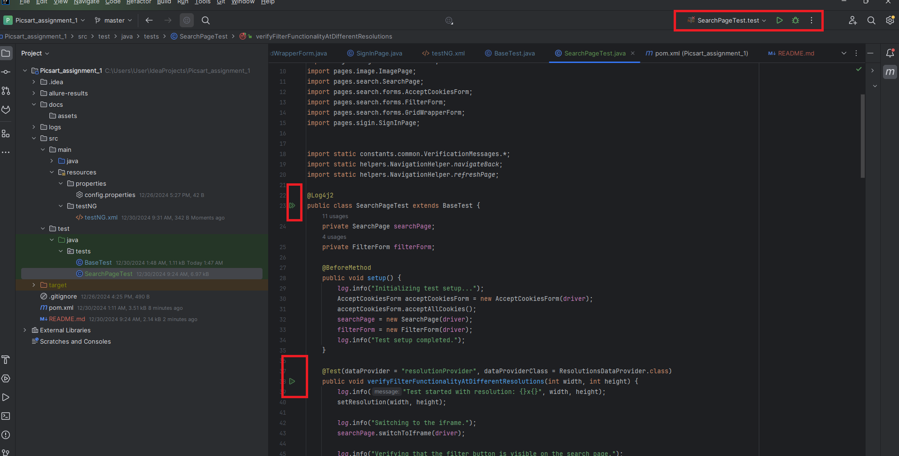
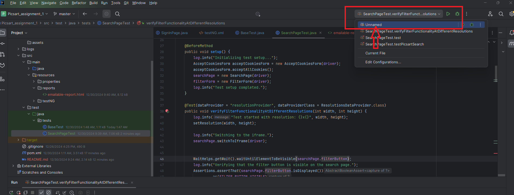
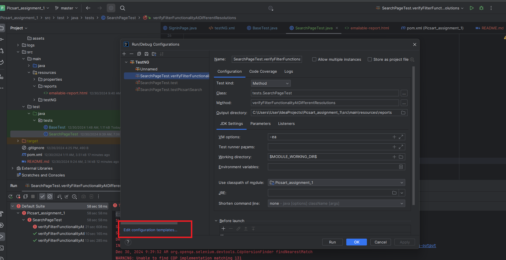
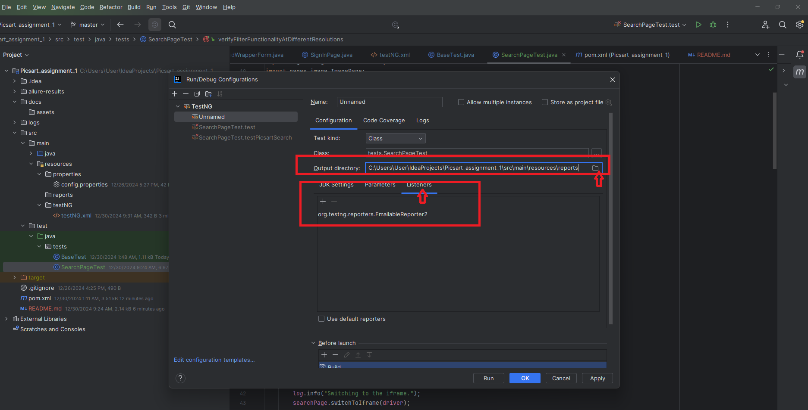

# picsart-search-test

This is a project of the automation test suite which uses the following technologies stacks:

* JDK 17
* Maven
* Selenium 4.x
* TestNG 7.x

## Installation and Requirements

Before running the tests locally, you should have these tools installed

1. JDK 17 or a later version [https://adoptium.net/temurin/releases/](https://adoptium.net/temurin/releases/)
2. Maven - [https://maven.apache.org/download.cgi](https://maven.apache.org/download.cgi)
3. Chrome browser

## How to run tests from IntelliJ IDE

1. Install IntelliJ IDEA or another IDE which you prefer
2. Clone or download project [https://github.com/GHovo/assignment_1.git](https://github.com/GHovo/assignment_1.git)
3. Open it in IDE as Maven project
4. Wait for dependencies to be downloaded and files to be indexed
5. For running entire suite, select tests package and choose 'Run 'Tests in "tests"'' option.
6. For running specific test, click "Run" button near test class name of method name or right-click name of file with test
   

## How to run tests from Command Line

1. Run all tests

shell script
mvn clean test

2. Run specific test

shell script
mvn clean test -Dtest=TestLogin

3. Run tests in multiple threads, **--Dthreads** parameter, expected values - 2, 3, 4, 5

shell script
mvn clean test -Dthreads=4

## How to edit Configuration adding Report listener and path

1. Open 'Edit Run/Debug configurations' dialog
   
2. Tap on 'Edit configuration' item
   
3. Tap on 'Edit configuration templates...'
   
4. Config 'Run/Debug configuration templates', add listener(org.testng.reporters.EmailableReporter)
   and report Output Directory(src/main/resources/reports)
   

## Open Report file

1. Open 'src/main/resources/reports' directory and double-click on 'emailable-report.html'
2. Choose option to open a local file URL
   

## How to configure new test class in TestNG xml file

To include the new test class in your TestNG XML file, follow these steps:
1. Open TestNG XML configuration file, which typically has a .xml extension.
2. Inside the <suite> element, add the <classes> tag if it doesn't already exist. The <classes> tag is used to specify the test classes that should be executed.
   *Make sure to specify the full package and class name within the name attribute of the <class> element.*
   ![runTest](docs/assets/testNGXML.png